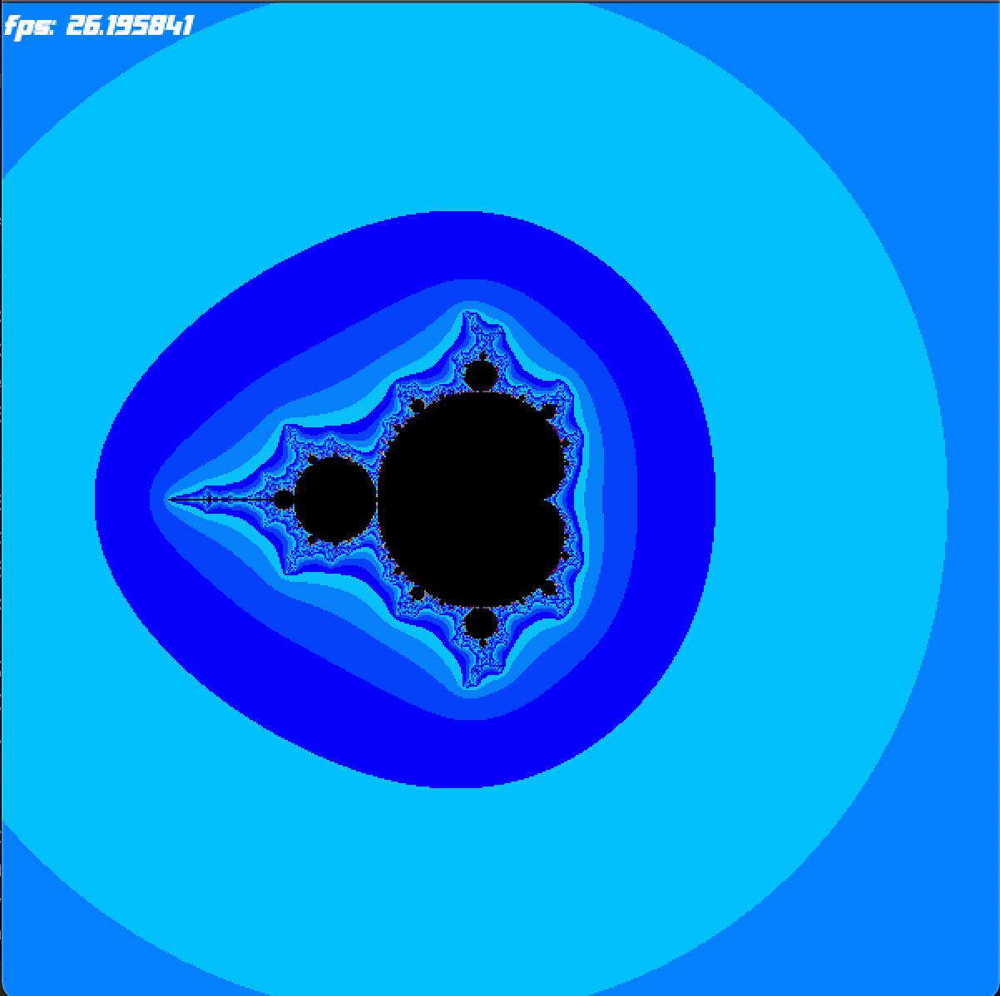
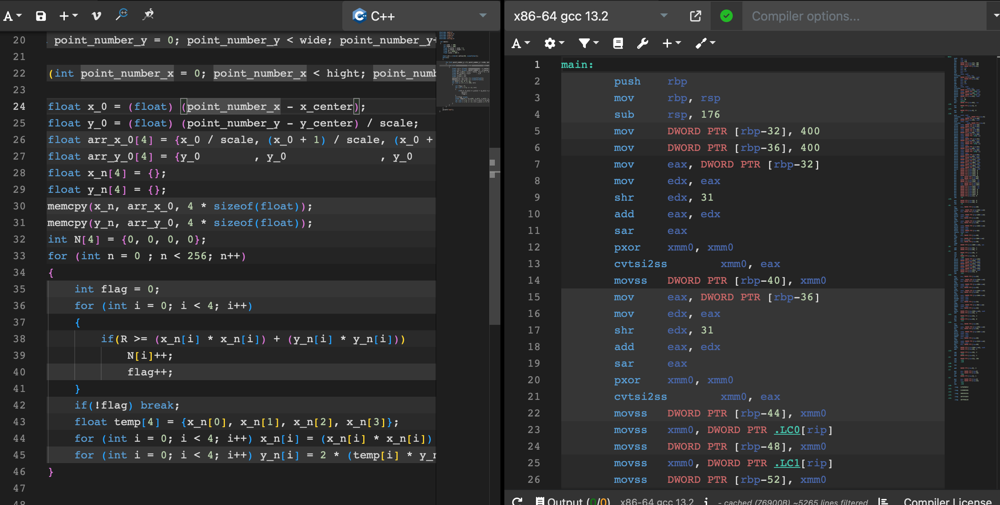

# Mandelbrot
В данной работе представлено сравнение оптимизации с помощью SIMD инструкций и .
## Цель:
Рассмотреть все возможные способы оптимизации программы на С и реализовать их.
## Ход работы:
Напишем 4 программы показывающих графическое представление множество Мандельброта. Вот пример графического представления множества:

## Принцип работы программы
+ При каждой итерации происходит расчет координат следующей точки по заданным ниже формулам, где x[0] и y[0] это координаты точки для которой мы считаем цвет.
+ Подсчет количества итераций останавливается если по итогу 256 итераций точка осталась в заданной области.
+ Цвет пикселей задается с помощью формулы (N, N % 8 * 32, 255 - N) в формате rgb где N это количество итераций при которых точка вылетает из заданной области, если же N = 256 то пиксель красится в черный цвет.
    * x[i] = x[i - 1]^2 - y[i - 1]^2 + x[0]
    * y[i] = 2 * x[i - 1] * y[i - 1] + y[0]

## Графический режим
* Стрелками мы можем двигать картинку в соответствующем направлении
* +/- увеличение и уменьшение масштаба соответственно
* ESC - выход из программы
* При дополнительном нажатии Shift смещение по экрану и зум увеличиваются в двое.

## Описание программ
1. Первая программа("Mandelbrot.cpp"): перебираем все координаты точек в окне и для каждой из них вычисляется количество итераций после которого точка вылетит из заданной области. Далее в зависимости от количества итераций мы ставим цвет пикселя.

2. Вторая программа("Mandelbrot+.cpp"): Теперь будем перебирать точки по 4 и добавлять их в массив , вычисляя соответствующий массив итераций (количество итераций после которого точка вылетит из заданной области). Далее в зависимости от количества итераций мы ставим цвет пикселя.
Посмотрим на то как наш компилятор переведет программу "Mandelbrot+.cpp" на Assembler

Видно что полученная программа на ассемблере очень схожа с "Mandelbrot++.cpp" так как компилятор автоматически преобразовал массивы в xmm регистры.

3. Третья программа("Mandelbrot++.cpp"): Теперь будем перебирать точки по 4 и добавлять, но вместо массивов будем использовать мультимедийные 128-битные регистры, и используя SIMD инструкции вычислять количество итераций после которого точка вылетит из заданной области. Далее в зависимости от количества итераций мы ставим цвет пикселя.

4. Четвертая программа("Mandelbrot256++.cpp"): Теперь будем перебирать точки по 8 и добавлять, но вместо массивов будем использовать мультимедийные 256-битные регистры, и используя SIMD инструкции вычислять количество итераций после которого точка вылетит из заданной области. Далее в зависимости от количества итераций мы ставим цвет пикселя.

### Запустим скрипт при стандарном зуме (120).

| номер программы | c использованием -O3 | с использованием -O2 | c использования -O0 | без флагов использования оптимизации |
|:---------------:|----------------------|----------------------|---------------------|-------------------------------|
| Simple          | 21.3598 ± 0.0034 fps |       23.3 ± 1.7 fps |      11.6 ± 1.1 fps |              11.77 ± 0.14 fps |
| Array           |     71.69 ± 0.02 fps |         72 ± 3.4 fps |     8.19 ± 0.31 fps |               8.18 ± 0.36 fps |
| SSE (128)       |     74.46 ± 0.12 fps |      74.32 ± 2.4 fps |     19.5 ± 0.26 fps |                19.2 ± 1.5 fps |
| AVX (256)       |    134.88 ± 0.24 fps |      134.9 ± 2.5 fps |     26.4 ± 0.12 fps |              25.67 ± 0.12 fps |

### Запустим скрипт при зуме = 1200 (при таком зуме все точки на экране не выходят из заданной области после 256 итераций и весь экран окрашивается в черный), при таком зуме наиболее заметно на сколько улучшилась производительность программы т.к время работы каждой программы максимальное.

| номер программы | c использованием -O3 | с использованием -O2 | c использования -O0 | без флагов использования оптимизации |
|:---------------:|----------------------|----------------------|---------------------|-------------------------------|
| Simple          |   1.718 ± 0.0034 fps |  1.7136 ± 0.0036 fps |   0.837 ± 0.011 fps |         0.85923 ± 0.00032 fps |
| Array           |      5.18 ± 0.02 fps |      5.17 ± 0.16 fps |   0.547 ± 0.013 fps |           0.5646 ± 0.0012 fps |
| SSE (128)       |      5.88 ± 0.12 fps |      5.89 ± 0.07 fps |     1.55 ± 0.13 fps |             1.546 ± 0.043 fps |
| AVX (256)       |     12.48 ± 0.24 fps |      12.45 ± 0.2 fps |   2.286 ± 0.005 fps |           2.2896 ± 0.0005 fps |

### Из таблиц видно что с помощью стандартных влагов оптимизации мы можем добиться ускорения программы в 2 раза, а при помощи использования SIMD инструкций можем ускорить программу еще в 7,26 раза. В результате мы показали что можем ускорить программу в 14,52 раз.

## Используемое оборудование
* Компилятор: Apple clang version 13.0.0 (clang-1300.0.29.30)
* Процессор: 2,4 GHz 2‑ядерный процессор Intel Core i5
* ОС: macOS Big Sur

## Вывод:
Самым оптимальным оказался способ в котором мы заменяем работу с 8-ми символьными массивами на работу с мультимедийными 256-битными регистрами через SIMD инструкции и дополнительной оптимизацией с помощью флага -О3, так нам удобиться ускорения программы в 14,52 раза.
### Все значения измеряются в fps

