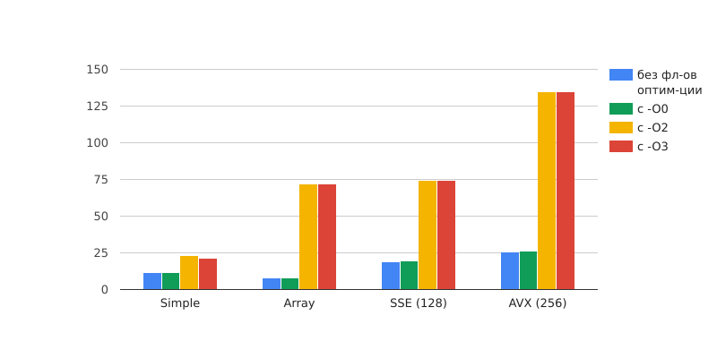

# Mandelbrot
В данной работе представлено использование SIMD инструкций для оптимизаций программ.
## Цель:
Рассмотреть все возможные способы оптимизации программы на С и реализовать их.
## Ход работы:
Напишем 4 программы ,отображающие точки множества Мандельброта. Вот пример графического представления множества:

## Принцип работы программы
+ При каждой итерации происходит расчет координат текущей точки по заданным ниже формулам, где x[0] и y[0] это координаты точки для которой мы считаем цвет.
    * x[i] = x[i - 1]^2 - y[i - 1]^2 + x[0]
    * y[i] = 2 * x[i - 1] * y[i - 1] + y[0]
    * Заданная область: круг радиуса 100.
+ Подсчет количества итераций останавливается ,если точка вышла за пределы окружности радиуса 100 или количество итераций превысило 256.
+ Если N < 256 цвет пикселей задается с помощью формулы (N, N % 8 * 32, 255 - N) в формате rgb где N это количество итераций при которых точка вылетает из заданной области, если же N = 256 то пиксель красится в черный цвет.
+ Цвет задается по следующим правилам в зависимости от индекса точка N ,где N это количество итераций при которых точка вылетает из заданной области:
    * Если N >= 256 то пиксель красится в черный.
    * Если N < 256

        | R |   G      |   B    | Alpha |
        |:-:|:--------:|:------:|:-----:|
        |N  |N % 8 * 32| 255 - N| 255   |

## Графический режим
* Стрелками мы можем двигать картинку в соответствующем направлении
* +/- увеличение и уменьшение масштаба соответственно
* ESC - выход из программы
* При зажатом Shift смещение по экрану и зум увеличиваются в двое.

## Описание программ
1. ### Первая программа
    Файл: "Mandelbrot.cpp". перебираем все точек и для каждой из них вычисляем количество итераций ,после которого точка выйдет из заданной области. Далее в зависимости от количества итераций мы задаем цвет пикселя.

2. ### Вторая программа
    Файл: "Mandelbrot+.cpp". Теперь будем перебирать точки массивами по 4 элемента, вычисляя соответствующий массив итераций (количество итераций после которого точка вылетит из заданной области).

Посмотрим на то как компилятор (clang-1300.0.29.30) транслирует программу "Mandelbrot+.cpp"

Видно что полученная программа на ассемблере очень схожа с "Mandelbrot++.cpp" так как компилятор транслировал работу с массивами в SIMD инструкции.

3. ### Третья программа
    Файл: "Mandelbrot++.cpp". Перебираем точки массивами по 4 элемента, но вместо массивов будем использовать мультимедийные 128-битные регистры, и используя SIMD инструкции вычислять количество итераций после которого точка вылетит из заданной области. Далее в зависимости от количества итераций мы ставим цвет пикселя.

4. ### Четвертая программа
    ("Mandelbrot256++.cpp"): Перебираем точки массивами по 8 элемента, но вместо массивов будем использовать мультимедийные 256-битные регистры, и используя SIMD инструкции вычислять количество итераций после которого точка вылетит из заданной области. Далее в зависимости от количества итераций мы ставим цвет пикселя.

### Запустим скрипт (testing.sh) при стандартном зуме (120).

| номер программы | c использованием -O3 | с использованием -O2 | c использования -O0 | без флагов использования оптимизации |
|:---------------:|----------------------|----------------------|---------------------|-------------------------------|
| Simple          | 21.3598 ± 0.0034 fps |       23.3 ± 1.7 fps |      11.6 ± 1.1 fps |              11.77 ± 0.14 fps |
| Array           |     71.69 ± 0.02 fps |         72 ± 3.4 fps |     8.19 ± 0.31 fps |               8.18 ± 0.36 fps |
| SSE (128)       |     74.46 ± 0.12 fps |      74.32 ± 2.4 fps |     19.5 ± 0.26 fps |                19.2 ± 1.5 fps |
| AVX (256)       |    134.88 ± 0.24 fps |      134.9 ± 2.5 fps |     26.4 ± 0.12 fps |              25.67 ± 0.12 fps |

### Запустим скрипт (testing.sh) при зуме = 1200
(при таком зуме все точки на экране не выходят из заданной области после 256 итераций и весь экран окрашивается в черный), при таком зуме наиболее заметно на сколько улучшилась производительность программы т.к время работы каждой программы максимальное.

| номер программы | c использованием -O3 | с использованием -O2 | c использования -O0 | без флагов использования оптимизации |
|:---------------:|----------------------|----------------------|---------------------|-------------------------------|
| Simple          |   1.718 ± 0.0034 fps |  1.7136 ± 0.0036 fps |   0.837 ± 0.011 fps |         0.85923 ± 0.00032 fps |
| Array           |      5.18 ± 0.02 fps |      5.17 ± 0.16 fps |   0.547 ± 0.013 fps |           0.5646 ± 0.0012 fps |
| SSE (128)       |      5.88 ± 0.12 fps |      5.89 ± 0.07 fps |     1.55 ± 0.13 fps |             1.546 ± 0.043 fps |
| AVX (256)       |     12.48 ± 0.24 fps |      12.45 ± 0.2 fps |   2.286 ± 0.005 fps |           2.2896 ± 0.0005 fps |

### Из таблиц видно что с помощью стандартных флагов оптимизации мы можем добиться ускорения программы в ($\frac{1.718}{0.85923}$ = 1,9995 , $\frac{0.0034 * 0.85923 + 1.718 * 0.00032}{0.85923^2}$ = 0.0047) 1,9995 ± 0.0047 раза, а при помощи использования SIMD инструкций можем ускорить программу еще в ($ \frac{12.48}{1.718} = 7.26, \frac{12.48 * 0.0034 + 1.718 * 0.24}{1.718^2} = 0.15$) 7.26 ± 0.15 раза. В результате мы показали что можем ускорить программу в (7.26 * 1.9995 = 14.51637, 7.26 * 0.0047 + 1.9995 * 0.15 = 0.33) 14.52 ± 0.33 раз учитывая абсолютную погрешность.

## Используемое оборудование
* Компилятор: Apple clang version 13.0.0 (clang-1300.0.29.30)
* Процессор: 2,4 GHz 2‑ядерный процессор Intel Core i5
* ОС: macOS Big Sur

## Вывод:
Самым оптимальным оказался способ в котором мы заменяем работу с 8-ми символьными массивами на работу с мультимедийными 256-битными регистрами через SIMD инструкции и дополнительной оптимизацией с помощью флага -О3, таким образом нам удалось добиться ускорения программы в 14,52 раза.
### Все значения измеряются в fps

### ***"От всей души хочу выразить благодарность и признательность Дединскому Илье Рудольфовичу (мяу), Жебрякову Даниилу Александровичу, Александрову Олегу Алексеевичу , Водолаженко Ивану Геннадьевичу, за оперативную помощь в редакции работы, кропотливое прочтение моей статьи, ценные замечания и рекомендации"***
